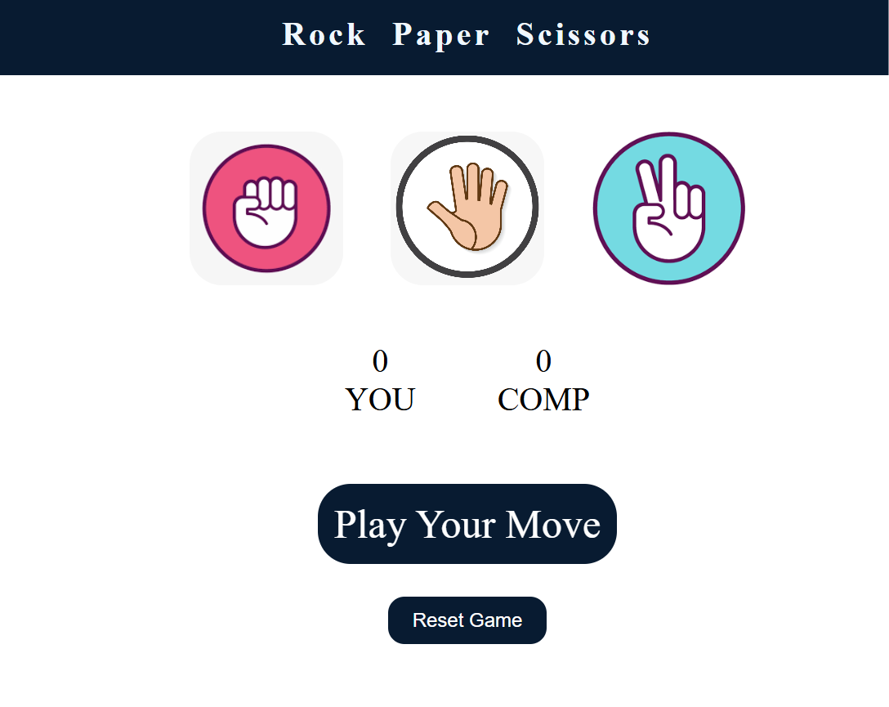
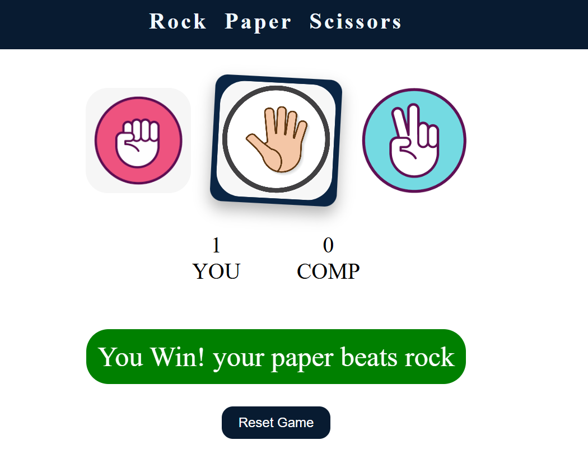
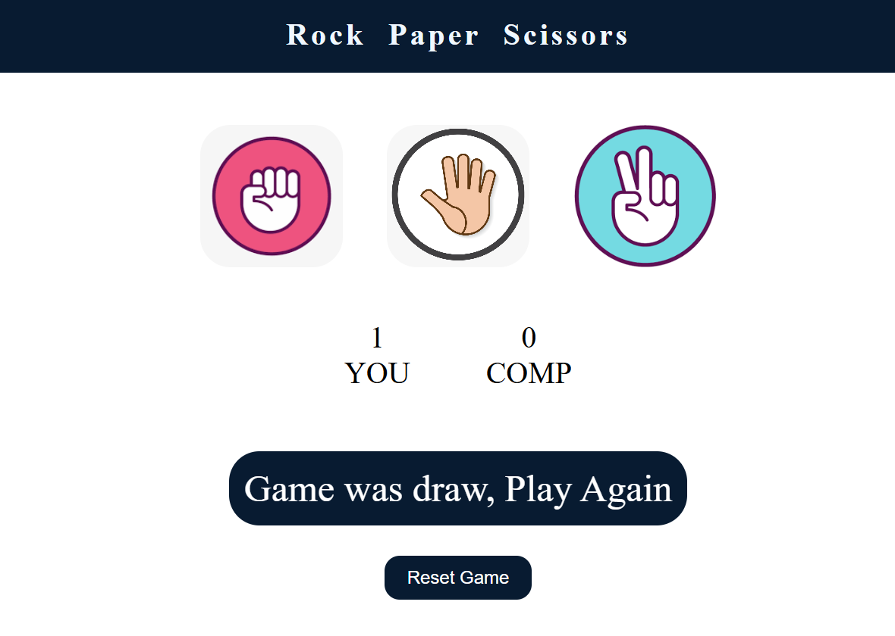
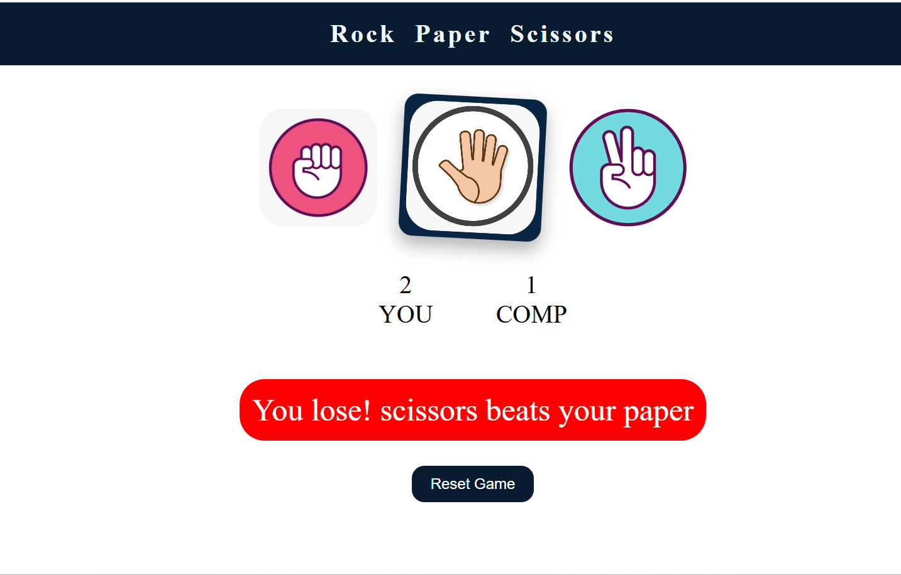

# 🪨📄✂️ Rock Paper Scissors Game

Welcome to the classic **Rock Paper Scissors** game, brought to life with modern web tech! 🎮 This fun, interactive project is built using **HTML, CSS, and JavaScript**—perfect for anyone who enjoys simple games and clean UI.

---

## ✨ Features

- ✅ Interactive gameplay with real-time results
- 📱 Fully responsive and mobile-friendly design
- 📊 Dynamic score tracking for you vs. the computer
- 🔁 Reset button to start fresh anytime
- 🎨 Smooth hover animations and modern UI effects

---

## 🚀 Live Demo

🌐 [Check it out here!](https://israr29.github.io/rock-paper-scissors-game/) 

---

## 🧰 Tech Stack

- HTML5
- CSS3 (Flexbox, Transitions)
- Vanilla JavaScript (DOM manipulation, game logic)

---

## 📸 Screenshots







---

[](#)


---

📬 Contact
Got feedback or ideas? Let’s connect!
Israr Ahmed
Email - im.israrahmed29@gmail.com


## 📁 How to Run Locally

```bash
git clone https://github.com/Israr29/rock-paper-scissors-game.git
cd rock-paper-scissors
open index.html   # Or use Live Server in VS Code


